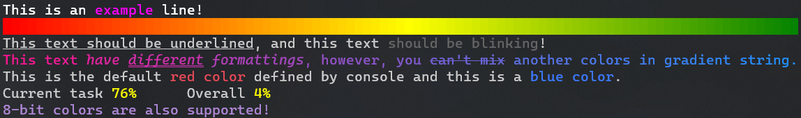



> ⚠️ **API has changed a bit in this version (1.0.2)!** One of changes are methods `Pastel()`, `PastelBg()` and `PastelDeco()`, they are now just `Fg`, `Bg` and `Deco`. Old methods will be removed in future, please switch to the new methods!

# PastelEx 💥
**Elevate Your Console Output with Colors and Styles**

> Inspired by the syntax of [Pastel](https://github.com/silkfire/Pastel) and [Crayon](https://github.com/riezebosch/crayon). PastelEx wouldn't exist without these incredible libraries.

Tested and Compatible with Windows and Linux terminals.

## 🎨 Inspiration
Adding ANSI color codes can be a confusing and challenging task to do manually. PastelEx simplifies the process of coloring and styling console output.

## ⚙️ How It Works
Using a simple syntax, like `"Hello, World!".Fg(Color.White)`, wraps your string in a special Unicode character sequence that instructs the terminal to apply color. This library offers benefits such as ease of use and automatic checks for terminal ANSI color support.

🔥 **Example:**
```csharp
using PastelExtended;
using System.Drawing;

Console.WriteLine($"Look, this text is {"colored".Fg("#ffff00")}!".Fg(Color.White));
Console.WriteLine(PastelEx.Gradient("And this one is gradient!", new[] { Color.Magenta, Color.Aqua }));
```

# ⚡ Performance Benefits
PastelEx efficiently enhances console output without excessive memory allocation. The library performs exceptionally well in comparison to alternatives.

Benchmark (lower values are better):
```
|   Method  |      Mean   |   Gen 0   | Allocated |
|-----------|------------:|----------:|----------:|
|   Pastel  | 2,551.55 ns |  1.2665   |   2656 B  |
| PastelEx  |    25.78 ns |  0.0382   |     80 B  |
|   Crayon  |   453.23 ns |  0.6266   |   1312 B  |
```

# 🧪 Tested and Verified
PastelEx is rigorously tested to ensure accurate and intended color and style rendering. It dynamically checks and adapts to your terminal's ANSI color support, providing a seamless experience.

**Note:** Avoid explicit calls to `PastelEx.Enable()`. PastelEx handles ANSI color code display automatically.

# 🚫 NO_COLOR Compatibility
PastelEx respects the `NO_COLOR` environment variable. If set, it disables color output to accommodate user preferences.

# 🚧 What PastelEx Doesn't Offer
While PastelEx empowers your console output, it doesn't provide tools for creating complex Console UI, panels, or tables.

